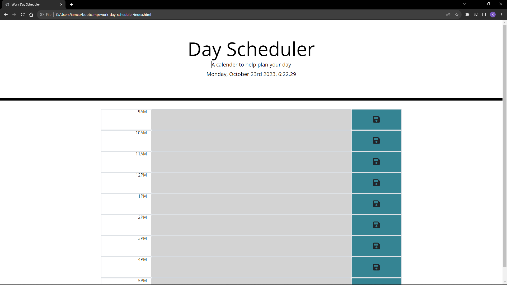

# work-day-scheduler

Link:

Discription:
For this application we were told to make a work day scheduler for day to day opertions. For this application I used jquery and bootstrap. I messed up with my local repo and the git hub repo on this project so I had to save all my work and delete the old repo so that is why there are almost no commits. I just added everything I had in the other one to this one and deleted the old one on github. It pretty basic like the example but I added different colors a couple places to spice it up. Thank god I found a exmaple code of the code it takes to make the contianers on bootstaps website that save me a bunch of times being able to add the rows super easy. 

Reqiurements:

GIVEN I am using a daily planner to create a schedule
WHEN I open the planner
THEN the current day is displayed at the top of the calendar
WHEN I scroll down
THEN I am presented with timeblocks for standard business hours of 9am&ndash;5pm
WHEN I view the timeblocks for that day
THEN each timeblock is color coded to indicate whether it is in the past, present, or future
WHEN I click into a timeblock
THEN I can enter an event
WHEN I click the save button for that timeblock
THEN the text for that event is saved in local storage
WHEN I refresh the page
THEN the saved events persist

Screenshot:

Sources:

https://getbootstrap.com/

https://jquery.com/

